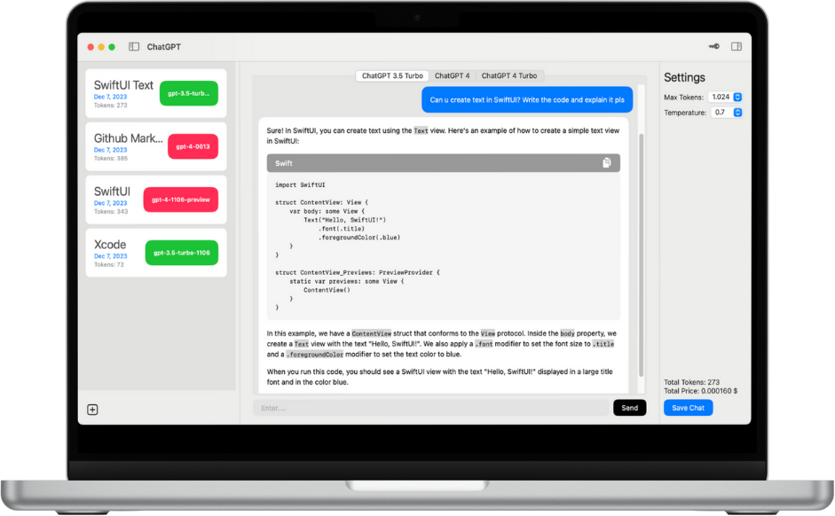
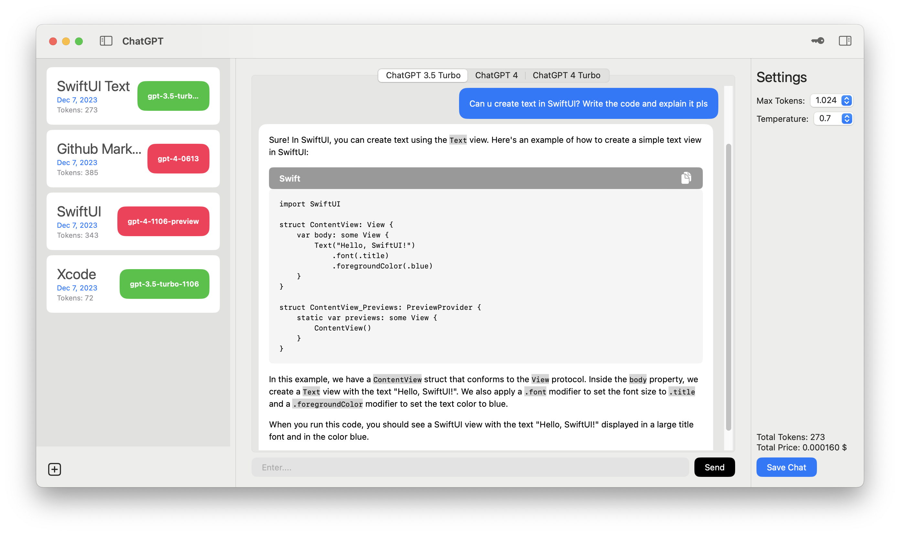

# ChatGPT macOS App / in development, not completed !

## About
With this macOS application, users can access the chatGPT services with the openAI api key.
The advantage of this application is that after loading a minimum balance of $5 from the official openai website, you can generate a private API key and access the latest chatgpt models.
Also, as you know, due to heavy usage, chatgpt's premium membership sales are sometimes stopped. You can continue to access the latest chatgpt models with this application.

## Features
- User can use this app after entering private openAI api key. Also can update api key at any time.
- User can access gpt-3.5-turbo-1106, gpt-4-0613, gpt-4-1106-preview(gpt-4-turbo) models.
- Chat is supports github markdown elements like heading, list, codeblock, table etc. [Github Formatting Syntax](https://docs.github.com/en/get-started/writing-on-github/getting-started-with-writing-and-formatting-on-github/basic-writing-and-formatting-syntax)
- User can set max tokens and temperature before chat.
- User can follow total tokens and total price during the chat.
- User can save chats to local storage. After that can load the chat.
- User can use full screen by hiding the right and left side bars.
- User can clear all chat from bottom left button.

## Keywords
- SwiftUI
- MVVM
- OpenAI API
- Alomofire
- SwiftUI Markdown UI
- UserDefaults

## App Views
||
|-|
||
||
|  |
